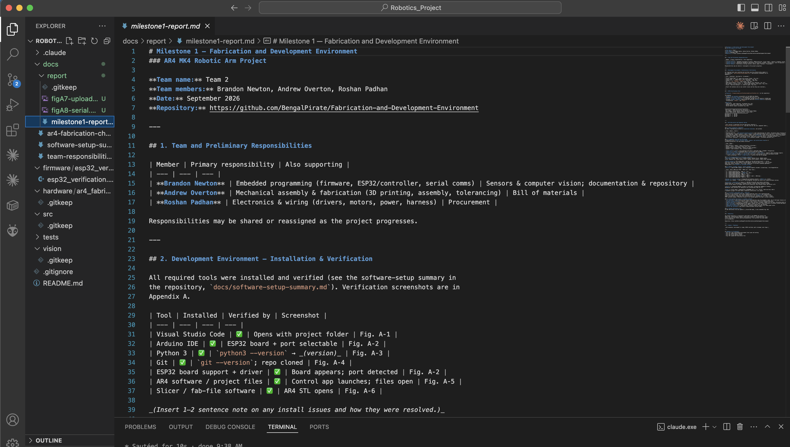
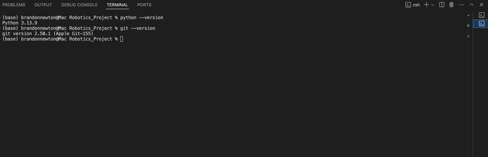
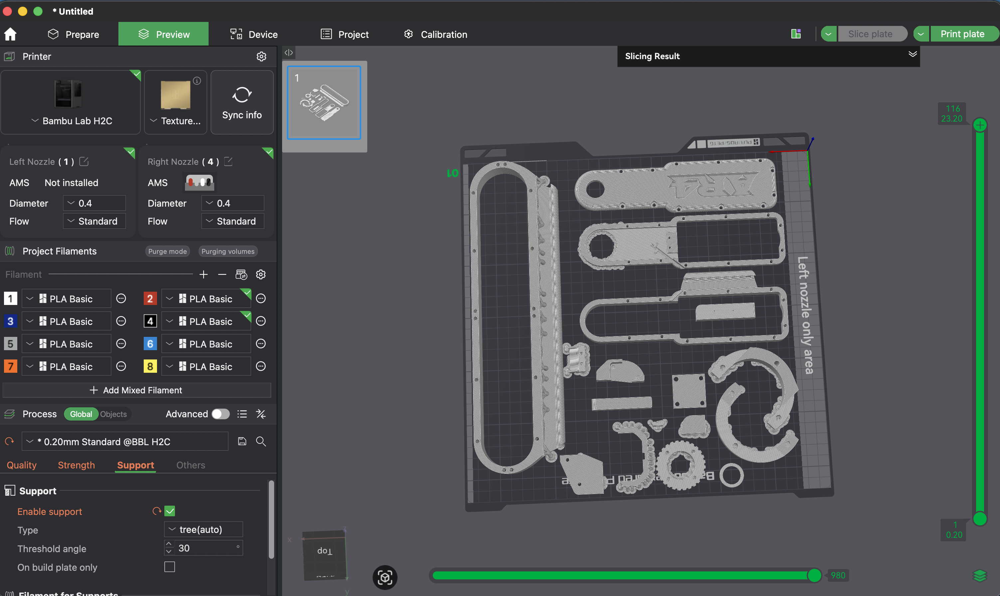
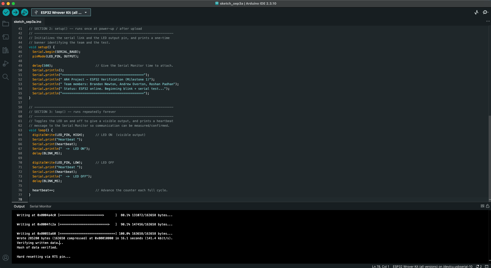
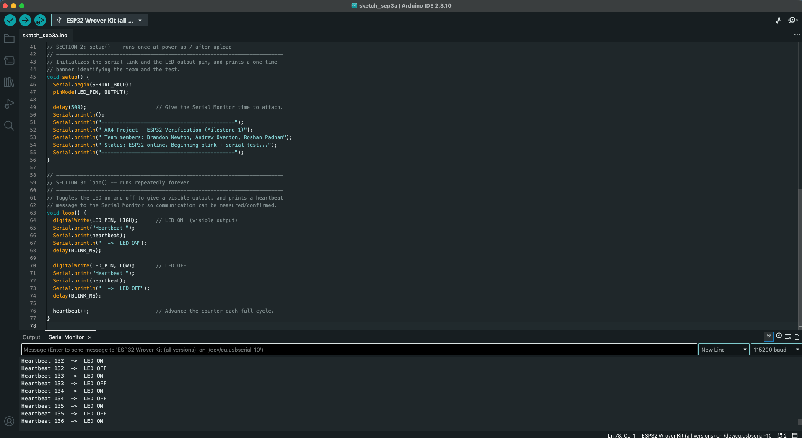
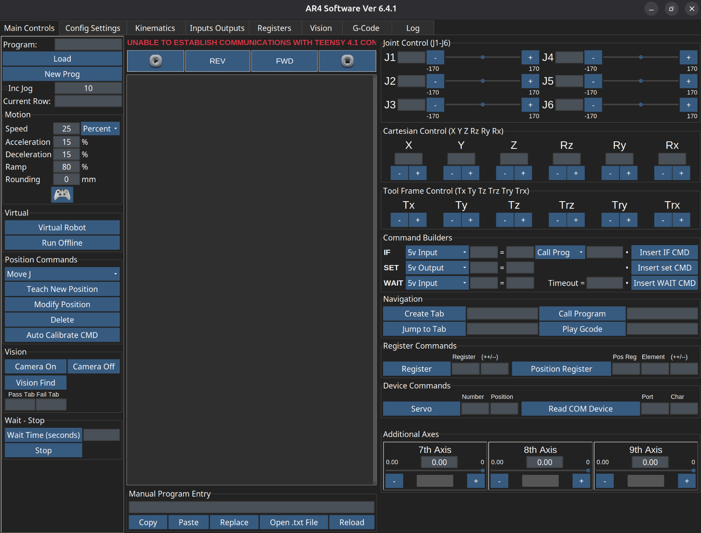

# Milestone 1 — Fabrication and Development Environment
### AR4 MK4 Robotic Arm Project

**Team name:** Team 2
**Team members:** Brandon Newton, Andrew Overton, Roshan Padhan
**Date:** September 2026
**Repository:** https://github.com/BengalPirate/Fabrication-and-Development-Environment

---

## 1. Team and Preliminary Responsibilities

| Member | Primary responsibility | Also supporting |
| --- | --- | --- |
| **Brandon Newton** | Embedded programming (firmware, ESP32/controller, serial comms) | Sensors & computer vision; documentation & repository |
| **Andrew Overton** | Mechanical assembly & fabrication (3D printing, assembly, tolerancing) | Bill of materials |
| **Roshan Padhan** | Electronics & wiring (drivers, motors, power, harness) | Procurement |

Responsibilities may be shared or reassigned as the project progresses.

---

## 2. Development Environment — Installation & Verification

All required tools were installed and verified (see the software-setup summary in
the repository, `docs/software-setup-summary.md`). Verification screenshots are in
Appendix A.

| Tool | Installed | Verified by | Screenshot |
| --- | --- | --- | --- |
| Visual Studio Code | ✅ | Opens with the project folder | Fig. A‑1 |
| Python 3 | ✅ | `python --version` → **Python 3.13.9** | Fig. A‑2 |
| Git | ✅ | `git --version` → **2.50.1 (Apple Git‑155)**; repo cloned | Fig. A‑2 |
| Arduino IDE + ESP32 board support/driver | ✅ | ESP32 board + `/dev/cu.usbserial-10` port selectable; sketch compiles & uploads | Fig. A‑4 |
| Slicer / fab-file software (Bambu Studio) | ✅ | AR4 STL parts open and slice | Fig. A‑3 |
| AR4 control software (Ver 6.4.1) | ✅ | GUI launches on the PC (Teensy not yet connected) | Fig. A‑6 |
| AR4 project files | ✅ | Repository + AR4 STLs open (VS Code / Bambu Studio) | Figs. A‑1, A‑3 |

The only notable issue was an ESP32 **upload failure during the high-speed flash
handshake** (esptool reported *"Unable to verify flash chip connection"* when
switching to 921600 baud). It was resolved by lowering the Arduino IDE upload speed
and using a data-capable USB cable connected directly to the computer; the sketch
then compiled and uploaded successfully (Fig. A‑4).

---

## 3. ESP32 Verification Test

**Program:** `firmware/esp32_verification/esp32_verification.ino` (in the repository).

The program:
- **Compiles and uploads** successfully to the ESP32 (chip ESP32‑D0WD‑V3, rev v3.1)
  over `/dev/cu.usbserial-10`, using the Arduino IDE ESP32 core.
- Produces a **visible output** — the on‑board LED blinks at 1 Hz.
- **Prints to the Serial Monitor** — a heartbeat message twice per second at 115200 baud.
- Includes **header comments** identifying the team and **section comments** explaining
  configuration, `setup()`, and `loop()`.

**Results:**
- Compilation & upload: successful — esptool reported *"Wrote 285280 bytes … Hash of
  data verified. Hard resetting via RTS pin…"* and the board reset and ran the sketch
  (screenshot Fig. A‑4).
- Serial Monitor output at 115200 baud (screenshot Fig. A‑5):

```
============================================
 AR4 Project - ESP32 Verification (Milestone 1)
 Team members: Brandon Newton, Andrew Overton, Roshan Padhan
 Status: ESP32 online. Beginning blink + serial test...
============================================
Heartbeat 0  ->  LED ON
Heartbeat 0  ->  LED OFF
Heartbeat 1  ->  LED ON
...
```

---

## 4. AR4 Fabrication and Component Review

_(This section is generated from the fabrication checklist —
`docs/ar4-fabrication-checklist.md`. See that file for the full component table.)_

### 4.1 Major mechanical components
The AR4's load-bearing structure is **machined aluminum**, not printed.

| Item | Detail | Source |
| --- | --- | --- |
| Aluminum parts kit | **26 machined aluminum pieces** — the links/housings for J1–J6 | Purchased (Annin "Aluminum Parts Kit") |
| Joint bearings | Angular-contact / taper / thrust / needle bearings at each joint (see §4.3) | Purchased (hardware kit) |
| Timing belts & pulleys | Belt-driven joints (MK3/4 use **HTD-series** belts on the belt-driven axes) | Purchased (hardware kit) |
| Fasteners & shafts | Metric machine/set screws, dowel pins, precision shafts | Purchased (hardware kit) |
| End effector (optional) | Servo gripper **or** pneumatic gripper | Purchased (optional kit) |

### 4.2 Components that must be 3D printed
Printed parts are **covers, enclosure panels, spacers, and switch/sensor mounts** —
secondary/protective, not the primary structure.

| Item | Notes |
| --- | --- |
| Base enclosure / panels | Houses electronics in the base |
| Guards / covers | Protective covers over joints |
| Homing-switch & sensor mounts | Mounts for limit switches |
| Spacers / small brackets | Misc. printed hardware |

- **File format:** **STL** (free download from Annin's downloads page / GrabCAD / Thingiverse).
- **Material:** **PETG** recommended (Annin's own printed sets are PETG).
- **Print settings (Annin spec):** ~**5 perimeters/shells**, ~**25% infill**, supports where overhangs require.
- **Filament needed:** roughly **1 spool** for a full set; a pre-printed set can be purchased instead.
- ⚠️ Exact printed-part **count is approximate** — confirm from the STL package.

### 4.3 Purchased mechanical & electronic components
**Bearings:** 30203 taper roller (17×40×13.25 mm), 35×52×4 thrust, HK1612 needle
roller (16×22×12 mm), B1616 needle roller, TRD1625 thrust washers, LM3UU linear bushings.

**Motion hardware:** HTD timing belts + pulleys on the belt-driven joints (⚠️ verify
exact belt pitch per joint against the MK4 manual), precision shafts (e.g., 3 mm × 85 mm),
dowel pins, metric fasteners / set screws. Reduction is via motor planetary gearboxes +
timing belts — **no harmonic or cycloidal drives**.

### 4.4 Motors, drivers, sensors, control hardware
**Motors** — geared NEMA steppers with integrated magnetic encoders (closed-loop), from StepperOnline:

| Joint | Motor (MK3/4-era SKU) | NEMA size | Gear ratio |
| --- | --- | --- | --- |
| J1 | 17HS15-1684D-EG10-AR4 | NEMA 17 | 10:1 |
| J2 | 23HS22-2804D-YGS50-AR4 | **NEMA 23** | 50:1 |
| J3 | 17HS15-1684D-EG50-AR4 | NEMA 17 | 50:1 |
| J4 | 11HS20-0674D-EGS16-AR4 | NEMA 11 | 16:1 |
| J5 | 17LS19-1684E-200G-AR4 (pancake) | NEMA 17 | belt / ~200-step |
| J6 | 14HS11-1004D-EGS20-AR4 | NEMA 14 | 20:1 |

**Drivers (6, one per joint)** — StepperOnline/Leadshine digital: **DM332T ×3** (J1–J3),
**DM320T ×3** (J4–J6). ⚠️ DIP-switch (microstepping) settings must match the firmware/software version.

**Controller / electronics:** Teensy 4.1 (600 MHz Cortex-M7) main motion controller;
Arduino Nano for 5 V peripherals (gripper/solenoid, inside the base enclosure in MK4);
ACS712 current sensor for gripper over-current protection; 2×12 terminal board; USB serial to PC.

**Sensors:** integrated magnetic encoder on each motor (closed-loop feedback to Teensy);
mechanical limit switches for homing per axis (SV-166-1C25; KW12 for J5).

**Power:** 24 VDC supply, StepperOnline LYD2409000 (24 V, ~9 A ≈ 216 W); robot max draw ~198 W.
A pneumatic gripper (if used) needs a separate 24 VDC brick + air supply.

### 4.5 Currently unavailable parts / materials
Inventory to be confirmed by the team. Longest-lead-time item is the **geared+encoder
motor set — order early**. Also verify availability of the **Teensy 4.1** (industry-wide
supply fluctuations). Remaining items (aluminum parts kit, hardware kit, 24 V PSU, ~1 spool
PETG, optional gripper, 3D-printer access) to be checked against the team's on-hand inventory.

### 4.6 Anticipated fabrication or assembly problems
- **J2 backlash** — most-cited accuracy issue; play amplifies down the kinematic chain. Set J2 belt/gear tension carefully.
- **Fragile homing switches** — easy to break a limit switch; follow the homing/config order.
- **Wiring density** — 6 motors + 6 encoders + 6 limit switches + gripper crammed into the base. Continuity-check every wire before power-up.
- **PETG printing** — warping/adhesion and support removal on covers; watch tolerances on brackets around bearings/switches.
- **Belt tensioning** — belt-driven joints need correct tension for low backlash.
- **Mandatory calibration** — required after flashing firmware and after any Teensy power cycle.
- **Driver DIP switches** — must match firmware/software version (MK3+).

### 4.7 Opened fabrication file
AR4 printable-part **STL** files were opened and sliced in **Bambu Studio** (targeting a
Bambu Lab H2C, 0.20 mm layer height) — see screenshot Fig. A‑3. This confirms the team
can open and prepare the AR4 fabrication files for printing.

---

## 5. Repository

The shared repository is organized as described in the README and contains the
ESP32 code, software‑setup summary, fabrication checklist, responsibilities, and a
folder structure for future code and documentation. The instructor has been added
as a collaborator.

Repository: https://github.com/BengalPirate/Fabrication-and-Development-Environment

---

## 6. Summary / Readiness

The development environment is fully installed and verified (VS Code, Python 3.13.9,
Git 2.50.1, the Arduino IDE with ESP32 support, and Bambu Studio for the fabrication
files). The ESP32 board test compiles, uploads, blinks the on-board LED, and streams a
heartbeat over serial, confirming the toolchain and PC-to-board communication. The AR4
MK4 bill of materials, printed parts, and control hardware have been reviewed and an AR4
STL was successfully opened and sliced. Next steps are to complete the parts inventory,
order the long-lead motor set, and begin authorized fabrication.

---

## Appendix A — Screenshots

**Fig. A‑1 — Visual Studio Code open with the project folder and Milestone 1 report.**



**Fig. A‑2 — Python and Git versions verified in the terminal (`python --version` → Python 3.13.9; `git --version` → 2.50.1).**



**Fig. A‑3 — AR4 STL parts opened and sliced in Bambu Studio (fabrication file).**



**Fig. A‑4 — ESP32 verification sketch compiled and uploaded successfully in the Arduino IDE.**



**Fig. A‑5 — Serial Monitor output at 115200 baud (LED-blink heartbeat).**



**Fig. A‑6 — AR4 control software (Ver 6.4.1) installed and launched on the PC. The "Unable to establish communications with Teensy 4.1" notice is expected — the controller is not yet connected at this stage.**


